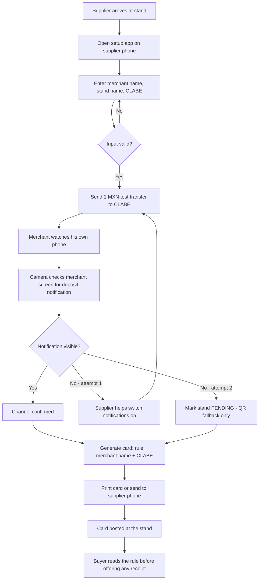
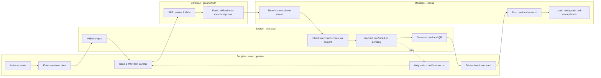

# PACKET — "Entrego cuando cae el dinero"

**Week 3 · Business Bending · When nothing can be verified**
**Author:** Fátima Fortes
**Slice:** The card and its distributor
**Status:** Blocks 1–4 complete · Blocks 5–10 in progress

---

## 1. Problem, in my words

The evidentiary collapse this chapter forecasts for video already happened, in 2021, to a payment receipt. Jesús — an agricultural supplier selling milk and maize from a local stand — handed over a wholesale order against a forged SPEI *comprobante*. An image edit. No model, no audio, no reconnaissance.

He did not misread the document. He had no way to read it.

Both tools that would have saved him already existed and were free: Banxico's CEP portal, public since 1 October 2025, and the deposit notification on his own banking app. He had the phone and the signal. He learned to read the notification only *after* losing the money — the training was the fraud. That money was the household's food: weeks of rationing, leaning on relatives and neighbors.

There is no missing technology in this case. There is a missing norm, and a missing distributor for it.

---

## 2. Exact user

**Jesús — agricultural supplier, local stand, milk and maize.**

He is who the product protects, and his outcome defines success. He does not register, does not install, does not read anything technical.

The **supplier** who reaches his stand is the *setup operator*, not the user. He touches the screens once, at delivery, and leaves. He is a distribution channel, not a customer.

---

## 3. Success definition

> **Before the module closes:** a merchant can finish a supplier visit with the rule published at his stand and deposit notifications confirmed working on his phone — having installed nothing, read nothing technical, and distrusted nobody.

---

## 4. Fact-check — deposit notifications (Appendix item #2, load-bearing for this slice)

**Question:** are settlement push notifications default-on or opt-in at BBVA, Banorte, Azteca, Mercado Pago? This determines whether the switch-on is one tap or four flows.

**Finding: configurable, not guaranteed by default. Varies by bank and by layer.**

- BBVA presents alerts as a service you activate, not a default. Its own landing page is titled "Activa alertas BBVA," and activating notifications appears as a separate step during account setup. Alertas Bancomer covers account activity including deposits to debit cards, and must be requested.
- Mercado Pago guidance repeats that real-time notifications must be activated, and notification preferences appear as a step in initial configuration.
- User-reported failure: a merchant asking how to activate notifications because they never arrive, who has to open the app to check whether a transfer landed, and who *already went to the branch* and still receives nothing.

**Two independent layers can be off:** the operating system's notification permission, and the movement alert inside the bank app. The branch-visit failure above shows this fails even with human help.

**Design consequence — this strengthens the slice rather than weakening it.** If the switch-on were one tap, nobody would need a distributor. The difficulty is the argument for the supplier visit.

**Design consequence #2 — confirmation cannot be self-report.** The system does not ask "are notifications on?" and it does not read a settings screen. The supplier sends a **1 MXN test transfer**, and the camera confirms the notification appeared on the merchant's screen. This proves the channel end-to-end regardless of which bank, which layer, or which failure mode was in play.

**Evidence limit, owned:** verified against secondary sources and user report. No primary bank documentation providing a clean default-state matrix across all four institutions was located.

---

## 5. Benchmark line

> **The best existing solution on Earth for this is** Osaka's ordinance of 1 August 2025 — Japan's first mandatory one — which fires unconditionally on the act of money moving (barring elderly customers from phones at ATMs, capping senior transfers at 100,000 yen/day) instead of waiting for someone to become suspicious.

> **Mine differs and localizes in that** Osaka hangs the rule on a counter with an employee, an employer, and a legal liability behind it — and in Mexico that counter is dissolving into phone transfers and four-minute Oxxo deposits, so the rule has to migrate to the stand itself, published before the buyer arrives, with nobody required to judge anybody.

**Why Osaka and not the UK Banking Protocol:** the Banking Protocol is a *judgment rule* — trained staff spot a scam in progress. It is disqualified by Condition 2. Osaka's ATM phone ban and transfer cap are *threshold rules*: they fire on the act, not on suspicion. Only threshold rules survive my own sorting criterion, because the victim never classifies their own situation — not during, and in one of my cases not fourteen years later.

---

## 6. Long view — light charter

If this slice worked, in three years *"entrego cuando cae el dinero"* stops being a product and becomes an assumed norm of Mexican street commerce, the way nobody argues about counting change before handing over the goods. The thing that distributes it is the supplier network that already walks those stands every week: the rule travels inside a channel that already exists, with no downloads and no marketing budget. What accumulates is not users but coverage — the day a buyer expects to find the card at any stand, the receipt fraud stops scaling, because the script no longer works anywhere.

---

## 7. Scope cut — what I am NOT building

- **The WhatsApp thread and the CEP query** — that is José Luis's slice of the fused build
- **Any analysis of the *comprobante*** — it is never read, never uploaded, never enters the system
- **Deepfake detection of any kind** — forbidden zone, and disqualified by the Blueprint's own facts
- **Real bank API integration** — no access exists; the 1 MXN test transfer substitutes for it
- **Merchant accounts** — Jesús registers nothing and installs nothing (Condition 3)
- **Family Shield / live social-engineering rules** — the Blueprint's backup vacuum, not this slice
- **Pricing, subscription, mass onboarding** — the price question was left unresolved in the Blueprint and I am not resolving it in code

---

## 8. The flow

### 8.1 Feature flowchart

### 8.2 Swimlane — who does what

### 8.3 What the swimlane proves

Ground truth originates in the **bank rail** — the only actor the counterparty cannot supply, forge, or influence (Condition 4).

The **merchant lane contains no judgment box**. Jesús shows his own screen and posts a card. At no point is he asked to evaluate anyone, refuse anyone, or voice distrust (Condition 2).

---

## 9. Mockup

Two screens rendered, both phone-format (portrait, ~320px) because the supplier operates from his own phone at the stand. Source files: `docs/mockups/03-prueba-notificacion.html` and `docs/mockups/04-tarjeta-generada.html`.

Interface language is Spanish throughout — the supplier and the merchant are Mexican. Only this packet is in English.

### 9.1 Screen 3 — notification test

The central moment of the product. Contents:

- **A simulation label in a warning band at the top of the screen:** *"Transferencia simulada. No se mueve dinero real."* Visible before anything else, per the brief's requirement that simulated outputs be labeled on screen.
- Destination summary — merchant name and masked CLABE.
- The action: *Enviar 1 peso de prueba.*
- A camera slot: *"Tome una foto de la pantalla de Jesús."*
- The success state: **"Sí llegó la notificación."**

**Note on the success wording.** The confirmation reads *"sí llegó la notificación"* — not *"verificado"*, not *"seguro"*, not *"cuenta confirmada"*. It is a claim about a channel, not about a person, a document, or a transaction. This wording is load-bearing: the moment the interface implies it has certified something, the product has drifted into the classification business it exists to avoid.

### 9.2 Screen 4 — the generated card

The artifact that stays at the stand.

- **Fixed headline, never varies:** *"Aquí entregamos cuando cae el dinero."*
- **LLM-adapted middle lines**, naming the actual goods: *"No entregamos leche ni maíz con el comprobante. Entregamos cuando suena la notificación del banco."*
- **Universality line:** *"Es la regla de este puesto. Es para todos, siempre."* This sentence carries Conditions 1 and 6 in the artifact itself — the rule fires on every transaction, so it singles out no buyer and teaches distrust of nobody.
- QR fallback plus merchant name and stand type.
- Actions: print, or send to the supplier's phone.

---

## 10. Architecture + stack

### 10.1 Screens

| # | Screen | Who touches it | What it does |
|---|---|---|---|
| 1 | Sign in | Supplier | Google auth via Supabase. Merchant never signs in. |
| 2 | Merchant details | Supplier | Name, stand type, CLABE. Validated before continuing. |
| 3 | Notification test | Supplier + merchant | Sends a **simulated** 1 MXN transfer, then a photo of the merchant's screen confirms the deposit notification arrived. |
| 4 | Card generated | Supplier | LLM-drafted rule card, print-ready, with QR. |
| 5 | Stand list | Supplier | Stands he has visited, each marked *confirmed* or *pending*. |
| — | Public rule page | Buyer | Opened by scanning the QR. States the stand's rule. Nothing else. |

### 10.2 Where the stack floor lands

**Vision — confirming the channel.** The supplier photographs the merchant's phone screen after the test transfer. The model answers one question: did a deposit notification appear, yes or no. It does not read amounts, does not evaluate legitimacy, does not judge the notification's contents. The supplier already knows he sent 1 MXN, so there is nothing to classify — only presence or absence.

**LLM — drafting the card.** The model receives the merchant's name and stand type and drafts the card text at the reading level this user needs. The headline is **fixed and never varies** — *AQUÍ ENTREGAMOS CUANDO CAE EL DINERO* — and the model adapts only the two middle lines, naming the actual goods ("no entregamos leche ni maíz" rather than "no entregamos la mercancía"). Fixed spine, controlled variation: the artifact gets printed and posted on a wall, so the core message cannot drift.

This is not decorative. Jesús reads slowly, and his loss came from being unable to read a document. A card written at his level is part of the product. It also matters at scale: a milk-and-maize stand, a flower stand, and an auto-parts stand do not speak alike, and the distributor network reaches all of them.

### 10.3 Simulation, labeled

No banking API exists for this build and no money moves. **The 1 MXN transfer is simulated and labeled on screen.** The brief permits simulated outputs when labeled; this is the only simulated element.

What the simulation does *not* touch: the camera confirmation is a real vision call against a real photo. The card generation is a real LLM call. Only the transfer itself is stubbed.

### 10.4 Stack table

| Layer | Choice | Why |
|---|---|---|
| Framework | Next.js (App Router) | Free tier, single repo, server routes for API keys |
| Hosting | Vercel | Auto-deploy from GitHub, environment variables |
| Database | Supabase (Postgres) | Free tier, Row Level Security built in |
| Auth | Supabase Auth + Sign in with Google | Required by the Security Floor |
| Vision | Gemini API (image input), free tier | Confirms the notification appeared |
| LLM | Gemini API (text), free tier | Drafts the card |
| QR | Client-side library | No external service, no data leaves |
| Styling | Tailwind | Fast, legible on a phone in daylight |

All free tier. No paid services.

### 10.5 Data model

Two tables:

**`stands`** — one row per merchant visited. Fields: id, supplier_id (FK to auth user), merchant_name, stand_type, clabe, status (`confirmed` / `pending`), created_at.

**`card_texts`** — the generated card text per stand, so a reprint produces the identical card. Fields: id, stand_id, body, created_at.

**Not stored:** the camera photo. The image is sent to the vision model, reduced to a yes/no, and discarded. It is never written to disk or to the database (Condition 5).

---

## 11. Test plan

### 11.1 Mechanical pass

| # | What is tested | Steps | Pass criterion |
|---|---|---|---|
| T1 | Auth gate | Open `/setup` while signed out | Redirected to sign-in. No stand data visible. |
| T2 | CLABE validation | Enter 17 digits, 19 digits, letters, empty | Each rejected with an inline message. Cannot continue. |
| T3 | Field length limits | Paste 500 characters into merchant name | Truncated or rejected at the limit. Nothing over-length reaches the database. |
| T4 | Simulation label | Reach screen 3 | The warning band is visible without scrolling. |
| T5 | Vision — positive | Photograph a screen showing a deposit notification | Returns confirmed; stand status set to `confirmed`. |
| T6 | Vision — negative | Photograph a screen with no notification | Returns not found; retry offered. |
| T7 | Retry ceiling | Fail the check twice | Stand marked `pending`; card still generates with QR. |
| T8 | Card content | Generate for "leche y maíz", then for "flores" | Headline identical in both. Middle lines name the correct goods. |
| T9 | Reprint stability | Generate, leave, return, reprint | Card text byte-identical to the first generation. |
| T10 | RLS isolation | Sign in as supplier B; attempt to read supplier A's stand | No rows returned. |
| T11 | Photo not persisted | Complete a check, then inspect storage and database | No image stored anywhere. |
| T12 | Public QR page | Open the QR target signed out | Rule text visible. No CLABE, no merchant phone, no supplier identity. |

### 11.2 Bug found, fixed, redeployed

> ⏳ To be filled during the build. Requires: description, cause, fix, commit hash, redeploy confirmation.

### 11.3 Persona test — Layer 1

**Synthetic user:** Jesús, 47, agricultural supplier. Sells milk, maize and farm produce from a local stand. Reads slowly. Uses WhatsApp; does not use his banking app beyond checking a balance. Lost a wholesale order in 2021 to a forged transfer receipt and has never described it as theft. Does not ask questions when confused — he goes quiet and waits.

**Method:** a fresh chat, persona loaded, screenshots pasted in order. The persona attempts the task as Jesús, narrating hesitation, misunderstanding, and the points where he would give up. Every confusion logged; the worst one fixed before the deadline.

**Note on what is actually being tested.** Jesús is not the person operating the app — the supplier is. What Jesús must do is show his own phone screen and, if notifications are off, find the setting with someone standing in front of him waiting. That is the moment to test: not the interface, but whether a slow reader can complete a bank-app settings task under social pressure without going silent. The fact-check found a user who went to a branch and still could not get notifications working, which suggests this step fails even with human help.

> ⏳ Log to be filled after the run. Deliverable: `PERSONA_fatima.pdf`.

---

## 12. Security floor

| # | Requirement | How it is met | Verified by |
|---|---|---|---|
| 1 | No secrets in code or repo | Anthropic and Supabase keys live only in Vercel environment variables. `.env.local` is gitignored from the first commit. All model calls run server-side in route handlers — no key ever reaches the browser. | Manual repo scan before final push |
| 2 | Auth on anything personal | Supabase Auth with Sign in with Google. The supplier signs in; `/setup` and the stand list are gated. | T1 |
| 3 | Row Level Security | RLS enabled on `stands` and `card_texts`. Policy: a supplier reads and writes only rows where `supplier_id = auth.uid()`. | T10 |
| 4 | Input validation on every form | Merchant name and stand type: length-capped, type-checked. CLABE: exactly 18 digits, numeric only. Nothing goes raw from a text box into the database or into a model prompt. | T2, T3 |
| 5 | No real personal data | Every seed and demo record is invented and labeled. Jesús Ramírez is a constructed figure; the CLABE shown in mockups is not a real account. The real Jesús from my user research appears nowhere in the repo, the seeds, or the demo. | Manual review |

### 12.1 Two additional decisions beyond the floor

**The camera photo is never stored.** It is sent to the vision model, reduced to a boolean, and discarded. Not written to disk, not written to Supabase, not logged. This is Condition 5, and it is stricter than the floor requires — the floor would permit storing it behind auth.

**The public QR page exposes nothing.** It renders the rule text and the stand name only. No CLABE, no phone number, no supplier identity, no scan analytics. It is the one unauthenticated surface in the product, so it holds no data worth reaching.

### 12.2 Known limitations, declared

**Model provider data use — this touches Condition 5.** The build runs on Google's Gemini free tier, chosen because it requires no payment and no credit card. Google's terms permit free-tier inputs and outputs to be used to improve their models. That means the camera frame — a photo of a phone screen — passes through a service that may retain it for training, even though this application never stores it.

Three things bound the exposure, and none of them make it disappear:

1. Every screen photographed in demos and testing belongs to an invented merchant, not a real person.
2. The application itself discards the frame after the boolean returns. Nothing is written to disk or database on my side.
3. The vision call asks one question — is a deposit notification present — and receives one boolean. No amounts, no names, no account data are requested or parsed.

A production version handling real merchants' phone screens could not ship on a free tier with these terms. It would need a paid tier or an equivalent that contractually excludes training use. Recording this as a known gap rather than resolving it in this slice.

**Simulated transfer.** No financial rail is touched and no banking credential is ever handled. This removes the largest attack surface a real version would carry. A production build would need a genuine answer for how the 1 MXN test transfer is initiated, and that answer is outside this slice.

---

## 13. Blueprint conditions honored

### Condition 1 — fires unconditionally

The card is posted before any buyer arrives. It states the rule for every transaction, with no threshold, no exception, and no trigger. Nothing about the design waits to be invoked, and nothing about it depends on the merchant noticing that something is wrong.

This is the condition my own evidence forced. Jesús did not classify his situation during the fraud, and Isabel had not classified hers fourteen years later. A rule that fires only on suspicion would have protected neither.

**Where it is visible in the build:** the card text — *"Es la regla de este puesto. Es para todos, siempre."*

### Condition 2 — shadow clause

**The rule carries the suspicion so no person has to.**

The refusal is printed and posted in advance. When a buyer offers a receipt, nobody has to say no — the card already said it, to everyone, before the buyer arrived. It does not come out of Jesús's mouth, and it does not come out of any employee's mouth.

This is the condition my slice was assigned to carry, and the mechanism is the publication itself. The comparison that makes it concrete: Osaka's ATM phone ban is a threshold rule and is permitted; the UK Banking Protocol requires a trained employee to judge a customer in front of them and is disqualified. My card is a threshold rule made of cardboard.

**Where it is visible in the build:** the swimlane. The merchant lane contains no judgment box. Jesús shows his own screen and posts a card; at no point is he asked to evaluate, refuse, or distrust anyone.

**The shadow it answers.** In Isabel's case the last line of defense was a courier who noticed the plan was sudden and said nothing — not from fear, but from courtesy. She was in full possession of her faculties, and questioning her would have meant treating her as though she wasn't. His deference was the final link in the chain. A design that requires a subordinate to voice distrust of the person paying them is a design that will fail exactly where Isabel's did.

### Condition 3 — no new surface

The merchant installs nothing, memorizes nothing, and carries nothing. He does not create an account, does not download an app, and does not learn a phrase. What he ends up with is a printed card and a notification his bank already offered him.

The only software is operated by the supplier, once, and then he leaves.

**Where it is visible in the build:** there is no merchant login anywhere in the product.

### Condition 4 — ground truth from an unsuppliable channel

The confirmation originates in the bank rail. The supplier sends 1 MXN; the notification either appears on the merchant's own phone or it does not. The counterparty cannot supply, forge, or influence that channel — which is exactly what he could do with the *comprobante*, and exactly what Isabel's attacker did by supplying the callback pretext.

**No answer is not permission.** If the notification does not appear, the stand is marked pending. Silence is never read as success.

**Scope honesty.** This slice confirms that the channel works; it does not verify individual transactions. Per-transaction settlement checking is José Luis's slice. Mine establishes that the merchant will be able to hear the rail at all — which the fact-check showed cannot be assumed.

### Condition 5 — no harvesting, nothing concealed

No raw audio. No biometrics. No chat logs. The camera frame is processed to a yes/no and discarded — never stored, never logged.

And nothing is hidden from the person the product protects. The setup happens in front of Jesús, on his own phone, with the supplier beside him. There is no version of this product that works by concealing it from him. If there were, it would be surveillance and it would not ship.

### Condition 6 — must not work by teaching distrust

The rule applies to every buyer, every time. It names no suspect and describes no warning signs. A buyer who reads the card learns the stand's policy, not that he is under suspicion.

This condition exists because of the second harm I recorded and did not bury: both households closed ranks after their attacks. Jesús's caution generalized to relatives who had nothing to do with it — his attack never came through the family, and the distrust spread there anyway. That immune response, at scale, produces the country where nobody answers an unknown number: the trust collapse arriving one household at a time.

A rule that fires on everyone teaches nothing about anyone. That is the point.

### 13.1 Dissent carried into the build

**My own recorded dissent applies to my slice too.** I hold that José Luis's bot creates exactly one new artifact for an attacker to counterfeit — a lookalike contact with a green *"Verificado"* bubble, one layer above the *comprobante* it replaced.

The same risk exists here, and I designed against it. The interface never says *verificado*. The success state reads *"sí llegó la notificación"* — a claim about a channel, not a certification of a person, a document, or a transaction. The card can be photocopied, and that costs an attacker nothing, because the card is not evidence. It is a published policy. There is no state in this product that an attacker gains anything by faking.

**José Luis's dissent, unresolved.** He holds that a card with no wallet has no funded distribution and dies in month three; the supplier's incentive is real but unpaid, and unpaid channels decay. I have not answered this, and I am not answering it in code. The price question was declared a bet in Collision 1 and never settled. It is recorded here as the load-bearing risk to the three-year view in section 6.

**Isabel's scope, on the record.** Isabel is structural evidence that the mechanism must be rail-independent. She is not covered by this build. The claim that the mechanism crosses rails and household types is scoped to the mechanism, not to this slice.

---

## 14. Evidence limits carried forward

n=5 households, all sampled on outcome, no failure case. Isabel second-hand on the courier. Jesús reconstructed in a single conversation. Cushion, attack vector, year, age, and urban/rural confounded at n=2. Isabel is recorded as structural evidence that the mechanism must be rail-independent — not as coverage by this build.
