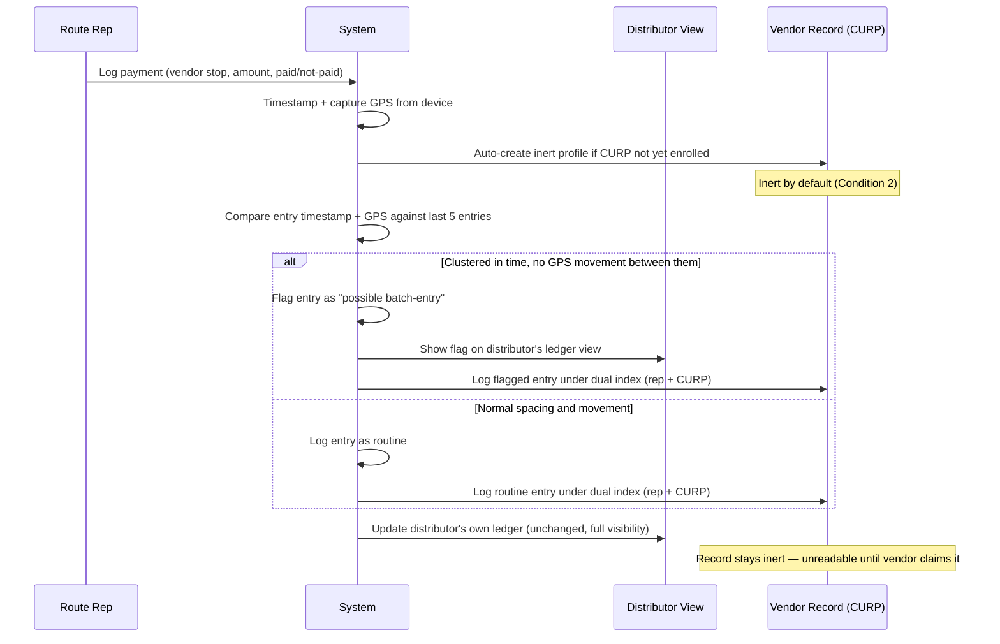

# PACKET — Week 2: Inert Enrollment + Batch-Entry Detection

**Fatima Fortes** | Role: OPERATOR | Team 3 | Vacuum: Evidence

## Problem (in my words)

Payment behavior that already proves a street vendor is reliable exists only inside her distributor's route rep's head or handwritten notebook, in a format no formal lender will read. My team's Blueprint calls this a legibility failure, not a solvency failure — she isn't a bad credit risk, she's an invisible one. This slice fixes the first two links: a record that exists automatically for every customer a distributor has (not just the risky-looking ones), and catching when that record was faked at the end of a tired rep's day instead of logged in the moment.

## Exact User

The route rep — not Doña Mari directly this week. He already visits her stall weekly, inside the distributor's existing preventa-style workflow. She's the beneficiary; he's who I'm building for, per my Team Bending declaration.

## Success Definition

> "Before the module closes, a route rep can log a payment for any stop in under 10 seconds, and the system flags an entry as 'possible batch-entry' when it's timestamped within the same 2-minute window as another entry with no GPS movement between them — without the rep filling any new field."

## Mockup — Route Rep Logging Screen

Generated screen mockup — matches the success definition above (single form, no extra fields).

## Flow Diagram

Swimlane by actor. GitHub renders this Mermaid block automatically.

## Benchmark

The best existing solution on Earth for this is **India's Account Aggregator framework** — regulated consent-based data movement where the party touching the data never owns it. Mine differs by replacing the AA's licensed neutral third party (unavailable in Mexico) with an inert, auto-enrolled profile design that removes the need for anyone to broker trust in the first place.

## Long-View Paragraph (Light Charter)

If this slice worked, the full product in three years is embedded infrastructure inside two or three of Mexico's largest route-based distribution networks — not an app anyone downloads, but a layer that turns years of informal credit judgment into a portable, tamper-evident record for millions of vendors who today have nothing to show a bank. It survives distributor churn and rep turnover because the record belongs to the CURP, not the company. It never becomes a credit score — it stays evidence, one input a human underwriter still has to weigh.

## Scope Cut (NOT building this week)

- No SOFIPO-facing disclosure flow (Condition 3 — José Luis's slice touches confirmation, mine doesn't reach disclosure).
- No real preventa integration — simulated/mocked GPS+timestamp feed, clearly labeled as such.
- No CURP verification against RENAPO (still a fact-check owed by the team).
- No fraud detection beyond timestamp clustering.
- No biometrics.

## Architecture + Stack

| Layer | Tool | Why |
|---|---|---|
| Frontend | Next.js (Vercel) | Same stack as Week 1 hello-world; rep's screen is a simple form |
| Database | Supabase (Postgres) | Two tables: `entries` (payment logs), `vendor_profiles` (inert, CURP-indexed) |
| Auth | Supabase Auth, Google | Rep logs in — personal data linked to real vendors, auth not optional |
| Batch-detection | Server-side function (Vercel) | Compares new entry vs rep's last 5 entries; flags if clustered |
| GPS/timestamp feed | Mocked in code, labeled | Real preventa integration out of scope this week |
| Mockup image | LLM image generation | Generated screen, not hand-waved |

**Security Floor:** no secrets in repo (Vercel env vars only) · Supabase Auth (Google) required, personal data behind login · Row Level Security on both tables, rep sees only own entries · form validates amount (numeric, bounded) and CURP (18-char format) · zero real vendor data in demo, invented and labeled.

## Test Plan

| # | Scenario | Expected result |
|---|---|---|
| TP1 | Rep logs a payment for a new vendor (never enrolled) | System auto-creates inert profile, entry logged under dual index. |
| TP2 | Rep logs 5 payments within 2 minutes, no GPS movement between them | All 5 flagged as "possible batch-entry." |
| TP3 | Rep logs 5 payments spaced normally through the day, GPS moving between each | No flags — logged as routine. |
| TP4 | Distributor views ledger | Sees all entries (flagged and unflagged), full visibility, unchanged from normal use. |
| TP5 | Rep attempts to log a payment with an invalid CURP format | Form validation blocks submission, clear inline error. |
| TP6 | Weekly batch job runs | Conflict-to-routine ratio per rep computed and shown in admin view (Condition 4). |
